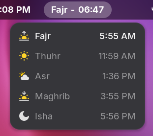

بِسْمِ ٱللهِ ٱلرَّحْمَٰنِ ٱلرَّحِيْمِ

# Prayer Time Gnome Extension

Highly customizable and efficient prayer time and athan reminder extension for Gnome.

> [!IMPORTANT]  
> The displayed prayer times are only approximate and not accurate down to the second, please allow for a small margin of error.

## :sparkles: Features:

-   Location: auto detection and custom parameters
-   Calculations:
    -   Preset and custom Fajr & Isha angles
    -   Asr shadow lengths
    -   High latitude Fajr and Isha correction (1/2 of night, 1/7th of night, and angle based)
    -   Optionally include sunnah prayers (Duha)
-   Notifications:
    -   Send notifications for prayers
    -   Play a shorter version of an athan for prayers
    -   Reminders before prayer time
-   Display:
    -   Automatic clock format detection
    -   Highlight next prayer in menu
-   Translations: Arabic

### :hammer: TODO:

-   Allow for custom time zones
-   Add icons to notifications
-   Add support for custom times (jamaaha) (manual preset and potentially csv)
-   Add current hijri date
-   Add option to force language to Arabic
-   Add dialogs as a notification option
-   Move to TypeScript
-   Enforce Eslint
-   Reload extension when gnome settings timezone is changed

## :handshake: Contribution:

As always any contributions are very welcome, this project is lilah and will inshAllah be counted as a charity. Before making any major changes or adding big features please create a pull request detailing everything. Furthermore, any major use of AI must be declared and the code from this repo must not be used to train them.

### :hammer: Building:

`make pack`: generates/builds the extension.zip. 
`make install`: installs the extension pack locally. 
`make clean`: cleans files generated when building (including the extension.zip). 
`make dev`: creates a new extension.zip, installs it then launches a nested gnome session.

### :trophy: Credits:

A special thanks to [praytimes.org](https://praytimes.org/) for documenting and providing the core time calculations, and the contributors who added to this project. May god reward you all greatly for it.

###### Inspiration taken from [AthanTime](https://github.com/GoodM4ven/PATCH_EXTENSION_GNOME_athan)
