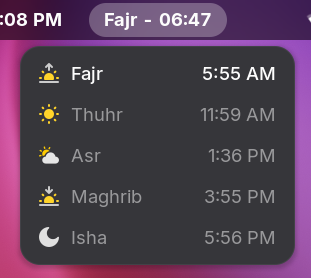

بِسْمِ ٱللهِ ٱلرَّحْمَٰنِ ٱلرَّحِيْمِ

# Prayer Time Gnome Extension

Highly customizable and efficient prayer time and athan reminder extension for Gnome.

> [!IMPORTANT]  
> The displayed prayer times are approximate and not accurate down to the second in favour of performance, please allow for a small margin of error.

## :sparkles: Features:

- Sources:
    - Manual location (latitude and longitude)
    - Automatic location (with fallback to manual location)
    - Mawaqit to display local mosque times (with a toggle for fallback to auto or otherwise manual location)
- Location Calculations:
    - Preset and custom Fajr & Isha angles
    - Asr shadow lengths
    - High latitude Fajr and Isha correction (1/2 of night, 1/7th of night, and angle based)
    - Optionally include sunnah prayers (Duha)
- Notifications:
    - Send notifications for prayers
    - Play a shorter version of an athan for prayers
    - Reminders before prayer time
- Indicator types:
    - Countdown to next prayer
    - Time of the next prayer
- Translations: Arabic

### :hammer: TODO:

- Add icons to notifications
- Add support for custom times (jamaaha) (manual preset and potentially json)
- Add current hijri date
- Add option to force language to Arabic
- Add dialog as a notification option
- Move to TypeScript
- Enforce Eslint
- Add the current source in menu with mosque icon (if using mawaqit)
- Add option to use iqamah for mawaqit
- Add a time period option to display "time for x prayer"

## :handshake: Contribution:

As always any contributions are very welcome, this project is liLah and will in sha Allah be counted as a charity. Before making any major changes or adding big features please create a pull request detailing everything. Furthermore, any major use of AI must be declared and the code from this repo must not be used for training.

### :hammer: Building:

`make install`: installs the extension locally. 
`make pack`: generates/builds a new extension.zip. 
`make clean`: deletes the generated extension.zip. 
`make dev`: installs the extension locally then launches a nested gnome session for testing.

### :trophy: Credits:

A special thanks to:

- [praytimes.org](https://praytimes.org/) for documenting and providing the core time calculations.
- [Mawaqit](https://mawaqit.net/) for the mosque search API and online prayer times.
- All contributors who added to this project.

May God reward you all greatly for it.
